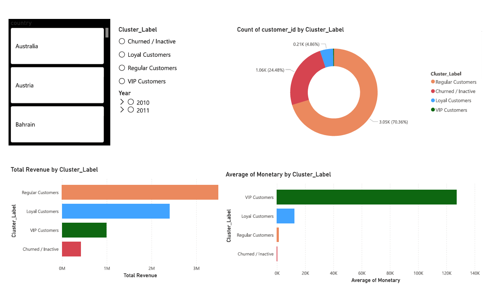

📊 E-Commerce Sales & Customer Behavior Analytics
🚀 Project Overview

Built an end-to-end analytics system to analyze customer purchasing behavior, segment customers using RFM and K-Means clustering, and predict churn using machine learning. Integrated PostgreSQL and Power BI for business visualization.

🛠 Tech Stack

Python (Pandas, Scikit-learn)
PostgreSQL
SQL
Power BI
Jupyter Notebook

📌 Key Features

Data cleaning & preprocessing (Python)
SQL-based business analytics
RFM customer segmentation
K-Means clustering
Logistic Regression churn prediction model
Churn probability scoring
Interactive Power BI dashboard

📈 Key Insights

33% churn rate detected
VIP customers contribute significantly higher revenue
Regular customers form 70% of customer base
Churn probability strongly correlated with recency

📷 Dashboard Preview

📂 Project Structure

notebooks/
sql/
powerbi/
images/
